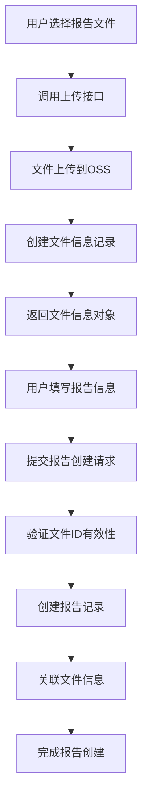

# 新建报告功能改造说明

## 改造概述

本次改造主要针对新建报告功能，实现了文件上传与报告创建的强关联，确保每个报告都必须有对应的报告文件。

## 主要改造内容

### 1. 新增文件信息表（file_info）

**表结构：**
```sql
CREATE TABLE file_info (
    id VARCHAR(50) PRIMARY KEY,           -- 文件ID
    file_name VARCHAR(255) NOT NULL,      -- 存储文件名
    original_name VARCHAR(255) NOT NULL,  -- 原始文件名
    file_size BIGINT NOT NULL,            -- 文件大小（字节）
    file_url VARCHAR(500) NOT NULL,       -- 文件访问URL
    file_type VARCHAR(50),                -- 文件类型
    folder VARCHAR(100),                  -- 存储文件夹
    upload_time TIMESTAMP,                -- 上传时间
    upload_user_id VARCHAR(50),           -- 上传用户ID
    status VARCHAR(20) DEFAULT 'ACTIVE'   -- 文件状态
);
```

**索引：**
- `idx_file_info_folder` - 文件夹索引
- `idx_file_info_upload_time` - 上传时间索引
- `idx_file_info_status` - 状态索引
- `idx_file_info_upload_user` - 上传用户索引

### 2. 修改报告表（reports）

**新增字段：**
```sql
ALTER TABLE reports ADD COLUMN report_file_id VARCHAR(50);
```

**新增索引：**
```sql
CREATE INDEX idx_reports_file_id ON reports(report_file_id);
```

### 3. 新增文件信息管理模块

**实体类：** `FileInfo.java`
**Mapper接口：** `FileInfoMapper.java`
**Mapper XML：** `FileInfoMapper.xml`
**服务类：** `FileInfoService.java`

**主要功能：**
- 文件信息的增删改查
- 文件状态管理（ACTIVE/DELETED）
- 文件验证（检查文件是否存在且有效）

### 4. 改造文件上传服务

**新增方法：**
```java
// 上传文件并保存文件信息
public FileInfo uploadFile(MultipartFile file, String folder, String uploadUserId)

// 上传报告文件并保存文件信息
public FileInfo uploadReportFile(MultipartFile file, String uploadUserId)
```

**改造要点：**
- 文件上传到OSS后，自动创建文件信息记录
- 返回完整的文件信息对象，包含文件ID
- 保持向后兼容，原有方法仍然可用

### 5. 新增文件上传接口

**接口：** `POST /v1/upload/report/info`
**功能：** 上传报告文件并返回文件信息（新建报告专用）
**返回：** 完整的文件信息对象，包含文件ID等

### 6. 改造报告创建流程

**验证逻辑：**
- 必须提供 `reportFileId`
- 验证文件信息是否存在且有效
- 自动填充文件相关信息（URL、名称、大小）

**数据流程：**
1. 用户上传报告文件 → 获得文件信息（包含文件ID）
2. 创建报告时提供文件ID → 系统验证文件有效性
3. 自动关联文件信息 → 完成报告创建

## 技术实现细节

### 1. 文件ID生成策略
```java
private String generateFileId() {
    return "file_" + UUID.randomUUID().toString().replaceAll("-", "").substring(0, 16);
}
```

### 2. 文件状态管理
- `ACTIVE`：文件正常可用
- `DELETED`：文件已删除（软删除）

### 3. 数据一致性保证
- 文件上传与文件信息创建在同一事务中
- 报告创建时验证文件信息有效性
- 支持文件状态变更和软删除

## 使用流程

### 1. 新建报告的标准流程



### 2. API调用示例

**步骤1：上传文件**
```bash
POST /v1/upload/report/info
Content-Type: multipart/form-data

file: [报告文件]
uploadUserId: user123
```

**响应：**
```json
{
  "code": 200,
  "message": "success",
  "data": {
    "id": "file_abc123def456",
    "fileName": "reports/20241201/abc123.pdf",
    "originalName": "市场分析报告.pdf",
    "fileSize": 2048576,
    "fileUrl": "https://oss.example.com/reports/20241201/abc123.pdf",
    "fileType": "pdf",
    "folder": "reports",
    "uploadTime": "2024-12-01T10:30:00",
    "uploadUserId": "user123",
    "status": "ACTIVE"
  }
}
```

**步骤2：创建报告**
```bash
POST /v1/reports/create
Content-Type: application/json

{
  "title": "2024年市场分析报告",
  "source": "研究机构",
  "category": "市场分析",
  "publishDate": "2024-12-01",
  "isFree": false,
  "price": 9900,
  "reportFileId": "file_abc123def456"
}
```

## 兼容性说明

### 1. 向后兼容
- 原有的文件上传接口仍然可用
- 原有的报告创建流程仍然支持（但不推荐）

### 2. 迁移建议
- 新功能建议使用新的上传接口 `/v1/upload/report/info`
- 旧接口主要用于维护现有功能

## 部署说明

### 1. 数据库迁移
执行以下SQL脚本：
```bash
# 创建文件信息表
source reader/sql/file_info.sql

```

### 2. 应用重启
- 部署新的代码后重启应用
- 确保新的Mapper XML文件被正确加载

### 3. 配置检查
- 确保OSS配置正确
- 检查数据库连接配置

## 测试建议

### 1. 功能测试
- 文件上传功能测试
- 文件信息创建测试
- 报告创建验证测试
- 文件状态管理测试

### 2. 异常测试
- 文件ID无效的情况
- 文件已删除的情况
- 网络异常情况
- 数据库异常情况

### 3. 性能测试
- 大文件上传测试
- 并发上传测试
- 数据库查询性能测试

## 注意事项

1. **文件ID必填**：新建报告时必须提供有效的文件ID
2. **文件状态验证**：系统会自动验证文件状态，确保文件可用
3. **数据一致性**：文件信息与报告信息保持强关联
4. **软删除支持**：文件支持软删除，避免误删导致的问题
5. **向后兼容**：原有功能不受影响，可以逐步迁移

## 总结

本次改造实现了：
- ✅ 文件上传与报告创建的强关联
- ✅ 文件信息的完整管理
- ✅ 数据一致性的保证
- ✅ 向后兼容性
- ✅ 完善的异常处理

改造后的系统更加健壮，数据管理更加规范，为后续功能扩展奠定了良好基础。
